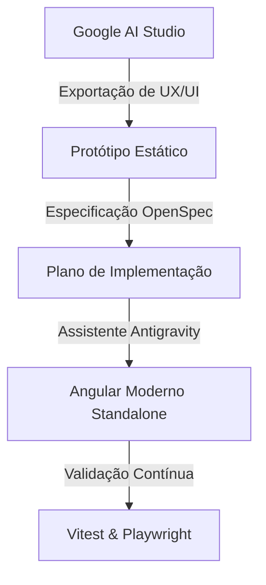

# 🏯 死滅回游 • Culling Games Control Panel

> *"Que comecem os Jogos do Abate. Que a energia amaldiçoada flua!"*

Bem-vindo ao **Culling Games Control Panel**, um painel tático de controle e monitoramento para o Jogo do Abate (*Shimi Kairui* - de *Jujutsu Kaisen*). Este repositório foi construído para servir de **projeto de estudo didático para Engenharia AI-Native**, demonstrando como criar aplicações modernas com Angular de forma colaborativa com agentes de inteligência artificial autônomos.

---

## 🎯 Objetivos Educacionais & Desenvolvimento Agêntico

Este projeto não foi programado da forma tradicional. Ele serve de demonstração prática para a transição impecável de um protótipo visual até o código de produção utilizando fluxos de trabalho dirigidos por IA:



### 🤖 Ferramentas de IA Utilizadas

1. **Google AI Studio (Prototipação Rápida):** A interface inicial, design system, paleta de cores e comportamento visual foram concebidos e refinados visualmente no AI Studio (dentro da pasta [`ux example`](file:///Users/alvarocamilloneto/antigravity/Culling-Games-Control-Panel/ux%20example)).
2. **Antigravity (Orquestrador de Codificação):** O agente autônomo Antigravity foi utilizado como o engenheiro principal de codificação local, traduzindo as especificações do protótipo em código Angular real de alta performance.
3. **OpenSpec Framework:** Framework de especificação e controle de ciclo de vida usado para planejar e documentar o desenvolvimento através de especificações delta (contidas em [`especs/basic_espec.md`](file:///Users/alvarocamilloneto/antigravity/Culling-Games-Control-Panel/especs/basic_espec.md)), garantindo que a IA executasse tarefas orientadas a metas estruturadas.
4. **Angular Agent Skills:** O desenvolvimento usou as regras oficiais de boas práticas de IA do Angular (`angular-developer` skill), aplicando reatividade moderna, arquitetura desacoplada e padrões recomendados de performance.

---

## 🔮 Arquitetura do Sistema e Tecnologias

A aplicação foi desenvolvida sob os pilares do **Angular Moderno** e estilizada com o tema sombrio e utilitário do Jogo do Abate.

### 🛡️ Tecnologias Envolvidas
- **Frontend Core:** **Angular v22** rodando com Componentes Standalone e o novo motor de fluxo de controle nativo (`@if`, `@for`).
- **Reatividade Nativa:** Estado reativo gerido 100% via **Angular Signals** (`signal`, `computed`, `effect`), dispensando o uso de RxJS para a gerência de UI direta.
- **Estilização:** **Tailwind CSS v4** com abordagem *utility-first* e tema escuro customizado.
- **Backend / SSR:** Arquitetura híbrida de renderização do lado do servidor (**Angular SSR** com Express em [`server.ts`](file:///Users/alvarocamilloneto/antigravity/Culling-Games-Control-Panel/culling-games-panel/src/server.ts)), servindo endpoints REST em memória para persistência de dados.

### 📁 Estrutura de Componentes (Metáfora Jujutsu Kaisen)

- 🏮 **`CullingGamesBoard`** *(Smart Component)*: O Domínio Incompleto que junta todas as peças e centraliza o estado.
- 📜 **`PlayerRegistration`** *(Dumb Component)*: O Voto de Vinculação (*Binding Vow*). Um formulário reativo para os feiticeiros entrarem no jogo, validando o nome, técnica amaldiçoada e colônia inicial.
- 🗺️ **`PlayerGrid`** *(Dumb Component)*: O Tabuleiro Geral. Lista os feiticeiros participantes, exibindo em tempo real quem está vivo/morto, suas técnicas e pontuações.
- ⚡ **`KoganeLogs`** *(Dumb Component)*: As transmissões do Kogane. Um feed de logs militarizados que reporta em tempo real eventos como entrada de feiticeiros e transferência de pontos.
- ⚖️ **`RulesModal`** *(Dumb Component)*: As regras originais estabelecidas por Kenjaku que definem o funcionamento da barreira.

---

## 🚀 Como Executar o Projeto

### Pré-requisitos
* **Node.js** (versão 20 ou superior recomendada)
* **npm**

### Passo a Passo

1. **Acesse o diretório do painel Angular:**
   ```bash
   cd culling-games-panel
   ```

2. **Instale as dependências:**
   ```bash
   npm install
   ```

3. **Inicie o servidor de desenvolvimento:**
   ```bash
   npm run start
   ```

4. **Acesse a aplicação:**
   Abra seu navegador e navegue até [http://localhost:4200](http://localhost:4200). A aplicação carrega dados simulados de feiticeiros icônicos como *Yuta Okkotsu*, *Hajime Kashimo* e *Hiromi Higuruma*.

---

## 🧪 Suíte de Testes

O repositório possui uma robusta estratégia de testes para assegurar que nenhuma alteração quebre as regras do Jogo do Abate.

### 1. Testes Unitários (Vitest)
Utilizamos o **Vitest** como runner de teste unitário alternativo integrado ao ecossistema do Angular CLI para garantir execuções instantâneas.

> [!TIP]
> Os testes unitários validam o comportamento isolado do serviço de estado (`CullingGamesService`), a validação de formulários do `PlayerRegistration` e a renderização básica de cada componente.

* **Executar os testes em tempo real (Watch Mode):**
  ```bash
  npx ng test
  ```
* **Executar os testes em execução única (CI/Pipelines):**
  ```bash
  npx ng test --watch=false
  ```

### 2. Testes E2E e Regressão Visual (Playwright)
O **Playwright** realiza testes ponta a ponta simulando as interações reais do usuário no navegador (como registro de feiticeiro, transferência de pontos e abertura do menu de regras).

> [!NOTE]
> O Playwright está configurado para inicializar automaticamente o servidor web de desenvolvimento antes de executar os testes, liberando o desenvolvedor de precisar rodar dois comandos em terminais separados.

* **Executar os testes E2E em modo Headless:**
  ```bash
  npm run e2e
  ```
* **Executar testes E2E com interface gráfica interativa (Playwright UI):**
  ```bash
  npm run e2e:ui
  ```

---

## 📜 Regras do Jogo do Abate Implementadas

O painel de controle respeita fielmente as regras originais do mangá/anime:
1. **Pontuação:** Feiticeiros iniciam com pontuações variadas e podem ter seus pontos alterados no painel.
2. **Transferência de Pontos:** Feiticeiros vivos podem transferir pontos entre si (regra adicionada por Megumi Fushiguro/Yuji Itadori). Não é permitido transferir pontos para feiticeiros mortos.
3. **Kogane:** Cada ação relevante gera um registro transmitido pelo Kogane no feed lateral.

> [!IMPORTANT]
> Se um feiticeiro morre (Status: *Deceased*), ele não pode mais transferir pontos nem ter seus pontos incrementados, simulando a perda de sua energia amaldiçoada.

---

*Este projeto é uma sandbox para você brincar com o Angular moderno e entender como agentes baseados em IA podem construir código altamente estruturado e coberto por testes. Sinta-se livre para expandir as regras de Kenjaku!*
