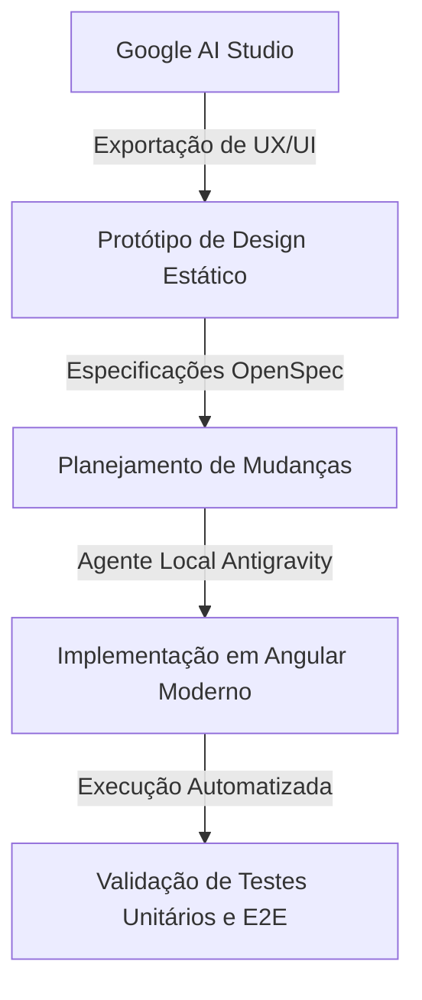

# Desenvolvimento AI-Native com Angular: Construindo o Painel do Jogo do Abate (Jujutsu Kaisen)

*Este projeto foi desenvolvido como submissão oficial para a **Agentic Architect Sprint**.*

Olá, dev! Se você se interessa por arquiteturas de software modernas e engenharia orientada a agentes de inteligência artificial, este projeto traz um estudo de caso prático e interessante. Vamos analisar a construção do **Culling Games Control Panel**: uma aplicação de controle e monitoramento baseada no universo de *Jujutsu Kaisen*.

Neste artigo, veremos como foi construída uma SPA (Single Page Application) com suporte a SSR (Server-Side Rendering) que gerencia participantes, exibe estatísticas em tempo real, registra logs de atividade e permite a simulação de regras temáticas (como a transferência de pontuações). 

Mais do que apenas um exemplo estético, este projeto é um exemplo didático de **Engenharia de Software AI-Native**, demonstrando a transição de um protótipo visual concebido no **Google AI Studio** para uma base de código de produção desenvolvida localmente com o agente **Antigravity** sob o framework de especificação **OpenSpec** e utilizando as tecnologias mais recentes do **Angular**.

---

## Arquitetura de Desenvolvimento Orientada a Agentes (AI-Native)

Antes de detalharmos o código, vale ressaltar que a aplicação foi desenvolvida seguindo um fluxo de trabalho moderno em que o desenvolvedor humano atua como arquiteto e revisor de decisões executadas por agentes autônomos de IA:



O ciclo de vida do desenvolvimento seguiu as seguintes etapas:
1. **Modelagem de UI (Google AI Studio):** O protótipo visual inicial contendo a paleta de cores escura, componentes de exibição e tipografia foi exportado diretamente do AI Studio (disponível na pasta [`ux example`](./ux%20example)).
2. **Definição de Especificações (OpenSpec):** Mapeamos as regras de negócio em especificações técnicas claras (contidas no arquivo [`especs/basic_espec.md`](./especs/basic_espec.md)), documentando as rotas da API, modelo de dados e requisitos não-funcionais.
3. **Desenvolvimento Agêntico (Antigravity + Angular CLI):** O agente Antigravity assumiu a tarefa de ler as especificações do OpenSpec e a base estática do protótipo, integrando-as em um projeto Angular limpo, estruturado e aplicando as melhores práticas de desenvolvimento (Angular Agent Skills).
4. **Verificação Automatizada:** Scripts de teste foram criados e rodados localmente para garantir a integridade das regras especificadas.

---

## 🛠️ Pré-requisitos e Instalação

Para executar a aplicação e os seus testes em sua máquina local, certifique-se de possuir:

* **Node.js** (versão 26 ou superior recomendada)
* **npm**

Navegue até a pasta da aplicação para instalar as dependências:

```bash
cd culling-games-panel
npm install
```

---

## 1. Arquitetura do Frontend: Componentes Standalone

A aplicação adota o padrão de **Componentes Standalone** (introduzido nas versões recentes do Angular), removendo a necessidade de módulos NgModules complexos. A estrutura de componentes divide-se de forma clara entre *Smart Components* (gerenciadores de estado e requisições) e *Dumb Components* (focados exclusivamente em apresentação):

* **`CullingGamesBoardComponent`** *(Smart Component)*: Serve como container principal da tela. Ele gerencia o estado consolidado da lista de feiticeiros e aciona os serviços para atualizar dados via requisições HTTP.
* **`PlayerRegistrationComponent`** *(Dumb Component)*: Formulário responsável por coletar dados de novos feiticeiros (nome, colônia inicial, técnica e pontos).
* **`PlayerGridComponent`** *(Dumb Component)*: Grid responsiva que exibe os participantes ativos em formato de cartões de perfil.
* **`KoganeLogsComponent`** *(Dumb Component)*: Painel lateral que atua como feed de eventos em tempo real, informando as transferências de pontos e novas inscrições.

---

## 2. Persistência de Dados: Backend Express no Servidor SSR

A fim de simplificar o ambiente de estudo e focar nos conceitos de arquitetura, a persistência de dados foi implementada de forma simplificada em memória. 

O motor de Server-Side Rendering (SSR) do Angular está configurado com um servidor Express tradicional no arquivo [`src/server.ts`](./culling-games-panel/src/server.ts). Esse arquivo, além de renderizar as páginas do lado do servidor, expõe endpoints REST que gerenciam o estado dos feiticeiros:

```typescript
// REST API Endpoints dentro do Express no servidor SSR
app.get('/api/players', (req, res) => {
  res.json(players);
});

app.post('/api/players', (req, res) => {
  const newPlayer: Sorcerer = req.body;
  if (!newPlayer.name || !newPlayer.colony) {
    res.status(400).json({ error: 'Name and Colony are required.' });
    return;
  }
  players.unshift(newPlayer);
  res.status(201).json(newPlayer);
});

app.put('/api/players/:id/points', (req, res) => {
  const { id } = req.params;
  const { points } = req.body;
  const player = players.find(p => p.id === id);
  if (!player) {
    res.status(404).json({ error: 'Player not found.' });
    return;
  }
  player.points = points;
  res.json(player);
});
```

---

## 3. Reatividade Moderna: Angular Signals-based Forms 

Uma das maiores novidades no ecossistema do Angular é a introdução experimental da biblioteca de formulários reativos baseados em sinais (`@angular/forms/signals`). Este projeto serve como um ótimo estudo de caso para entender como ligar campos de entrada a sinais atômicos de reatividade nativa sem depender de fluxos complexos de RxJS ou da reatividade tradicional baseada em objetos do FormGroup.

Observe no código de [`player-registration.component.ts`](./culling-games-panel/src/app/components/player-registration/player-registration.component.ts) como a validação e o mapeamento são estruturados:

```typescript
import { Component, output, signal } from '@angular/core';
import { form, FormField, submit, required, min, max } from '@angular/forms/signals';
import { Sorcerer } from '../../models';

@Component({
  selector: 'app-player-registration',
  standalone: true,
  imports: [FormField],
  templateUrl: './player-registration.component.html'
})
export class PlayerRegistrationComponent {
  readonly playerRegistered = output<Omit<Sorcerer, 'id'>>();

  // Modelo reativo declarado como um Signal contendo o objeto de dados
  protected readonly model = signal({
    name: '',
    colony: 'Tokyo Colony No. 1',
    technique: '',
    points: 0,
    status: 'Alive' as 'Alive' | 'Deceased'
  });

  // O Signal-based Form vincula validações de forma declarativa sobre o modelo
  protected readonly registrationForm = form(this.model, (s) => {
    required(s.name, { message: 'Sorcerer Name is required.' });
    required(s.colony, { message: 'Starting Colony is required.' });
    min(s.points, 0, { message: 'Points cannot be negative.' });
    max(s.points, 1000, { message: 'Points cannot exceed 1000.' });
  });

  onSubmit() {
    submit(this.registrationForm, async () => {
      const val = this.model();
      this.playerRegistered.emit({
        name: val.name.trim(),
        colony: val.colony,
        technique: val.technique.trim(),
        points: val.points,
        status: val.status
      });

      // Reseta o estado do modelo usando signals
      this.model.set({
        name: '',
        colony: 'Tokyo Colony No. 1',
        technique: '',
        points: 0,
        status: 'Alive'
      });
      this.registrationForm().reset();
    });
  }
}
```

No arquivo HTML [`player-registration.component.html`](./culling-games-panel/src/app/components/player-registration/player-registration.component.html), os inputs se vinculam diretamente ao controle de sinal:

```html
<input 
  type="text" 
  [formField]="registrationForm.name"
  placeholder="e.g., Hajime Kashimo" 
  class="..."
>
@if (registrationForm.name().touched() && registrationForm.name().errors().length) {
  <div class="text-red-500 text-[9px] uppercase tracking-wider font-mono font-bold">
    {{ registrationForm.name().errors()[0].message }}
  </div>
}
```

---

## 4. Garantia de Qualidade: Estratégia de Testes Automatizados

A estabilidade e as regras de negócio da aplicação são asseguradas por duas vertentes de testes automatizados:

### 🧪 Testes Unitários com Vitest
Em substituição ao Karma tradicional, o projeto utiliza o **Vitest**, um test runner extremamente rápido que consome o arquivo de configuração `vitest.config.ts`. Os testes cobrem a lógica do serviço de estado (`CullingGamesService`), o ciclo de validação do formulário e a renderização estrutural dos componentes.

* **Executar os testes em execução única (recomendado para CI):**
  ```bash
  npx ng test --watch=false
  ```
* **Executar em modo contínuo (Watch Mode):**
  ```bash
  npx ng test
  ```

### Testes End-to-End (E2E) com Playwright
O **Playwright** realiza testes completos simulando o fluxo de uso da aplicação em navegadores reais. Ele valida interações complexas como o registro de feiticeiros, a transferência de pontuações entre participantes vivos e as restrições impostas por regras de negócio (como bloquear transações de pontos para personagens declarados como mortos).

O arquivo `playwright.config.ts` possui uma diretiva `webServer` que inicializa o servidor de desenvolvimento local de forma autônoma e aguarda a porta `4200` estar ativa antes de iniciar a suíte.

* **Executar os testes E2E em modo headless (terminal):**
  ```bash
  npm run e2e
  ```
* **Executar em modo interativo com a interface gráfica do Playwright:**
  ```bash
  npm run e2e:ui
  ```

---

## 5. Extensibilidade Agêntica: Skills de IA & Atuação no Navegador (`/browser`)

Um dos maiores diferenciais deste projeto de Engenharia AI-Native é a forma como o agente de IA é guiado por diretrizes específicas de desenvolvimento e realiza verificações em tempo real.

### Como Instalar e Utilizar as Skills do Angular e OpenSpec

Para ensinar estes padrões modernos ao seu agente de codificação e habilitar este fluxo de trabalho no seu próprio repositório:

1. **Instalação das Skills Oficiais do Angular:**
   Utilize a CLI de gerenciamento de skills do Angular (através do `npx`) para injetar as diretrizes de reatividade moderna no contexto do agente:
   ```bash
   npx skills add https://github.com/angular/skills
   ```
   Isso adicionará a pasta `.agents/skills/angular-developer` no seu workspace, contendo o arquivo `SKILL.md` com instruções detalhadas sobre Signals, Componentes Standalone e boas práticas que o agente consumirá antes de codificar.

2. **Instalação do CLI do OpenSpec:**
   O OpenSpec permite gerenciar o ciclo de vida das especificações de mudanças através de um conjunto de comandos simples. Instale-o globalmente em sua máquina usando:
   ```bash
   npm install -g @fission-ai/openspec@latest
   ```
   Após a instalação, você pode iniciar o framework no seu repositório rodando:
   ```bash
   openspec init
   ```
   Isso cria a pasta `.agent/workflows/` (contendo comandos integrados como `/opsx:propose`, `/opsx:apply` e `/opsx:archive`), estruturando a transição segura e rastreável de tarefas feitas por agentes.

### Verificação de UI com Atuação de Navegador (`/browser`)
Os testes e2e não precisam ser verificados apenas via console. Durante o ciclo de vida do OpenSpec, o desenvolvedor ou o próprio agente pode executar comandos de verificação visual por meio de ferramentas de automação baseadas em Chrome Headless (com a diretiva `/browser` ou ferramentas de subagentes de navegação). 

Isso garante que o agente:
- Inicie a build do servidor local em segundo plano.
- Abra o navegador automaticamente, navegue pela aplicação e interaja com os elementos DOM (ex: preencher o formulário de cadastro, clicar nos botões de incremento de pontos).
- Capture imagens e vídeos (WebP) do fluxo de telas para validar de forma autônoma a fidelidade visual e a coerência estética das interfaces em relação ao design concebido no AI Studio.

---

## Como Executar a Aplicação Localmente

Após instalar as dependências com `npm install`, inicie o servidor local:

```bash
npm run start
```

Acesse o endereço [http://localhost:4200](http://localhost:4200) em seu navegador. A aplicação será inicializada com dados estáticos de simulação, permitindo adicionar novos participantes, modificar pontos de personagens específicos e verificar a atualização dinâmica das estatísticas gerais exibidas no cabeçalho do painel.

---

## Conclusão e Próximos Passos

Este repositório é um exemplo prático de como novas ferramentas de IA generativa facilitam a prototipação e a codificação, fornecendo uma base de estudo rica tanto para a arquitetura moderna do Angular quanto para o desenvolvimento de software auxiliado por agentes autônomos.

Se você deseja avançar no estudo deste projeto, sugerimos os seguintes exercícios:
1. **Persistência de dados externa:** Substituir a lista em memória no servidor SSR por conexões a um banco de dados real.
2. **Integração com IA:** Consumir a API do Gemini no backend Express para gerar comentários automáticos em formato de notícias do Kogane sempre que um feiticeiro ganhar pontos ou for registrado no jogo.
3. **Novas regras de negócio:** Estender a validação de formulários baseada em sinais para incluir novas colônias e tipos de habilidades.

Todo o código-fonte, suítes de teste e especificações estão contidos neste repositório:
**[Repositório no GitHub](https://github.com/alvarocamillont/Culling-Games-Control-Panel)**

Bons estudos e até o próximo projeto!
